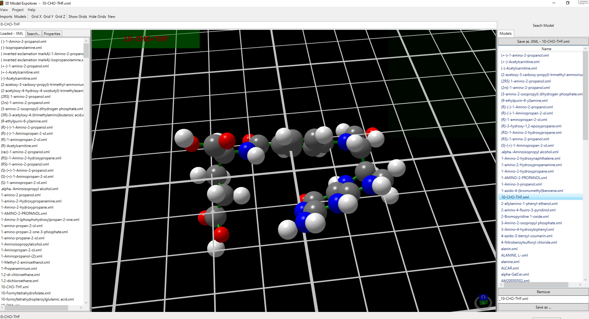

# 3D Model Explorer

Program designed to fetching 3D substances formulas, loading, viewing and editing 3D views.

3D formulas are retrieved from external service by REST protocol.

3D formulas are written in XML format, that has been serialized to .NET classes (C#).

Retrived 3d formula are converted to .NET classes.

Particles are then visualized in Helix3D library.

# Installation and build

Build Helix3D library from repository.

Copy build files into Libraries directory.

Open 3dModelExplorer.sln in Visual Studio, build an run.

# Workflows

There are three main ways to explore 3D particle views.

1. Loaded directly models in XML are saved and displayed in page 'Loaded - XML'
Selection of the file, displays the 3D model view and saves the model into Models tab in the internal format

2. 3D models saved in the internal format can be viewed by selecting names of models in the 'Models' tab

3. Entering desired phrase in the search box and pressing Search Model button, displays list of retrieved compounds and particles. 
After selecting particles names in the 'Search' tab -> models are retrieved and created in the 'Models' tab

