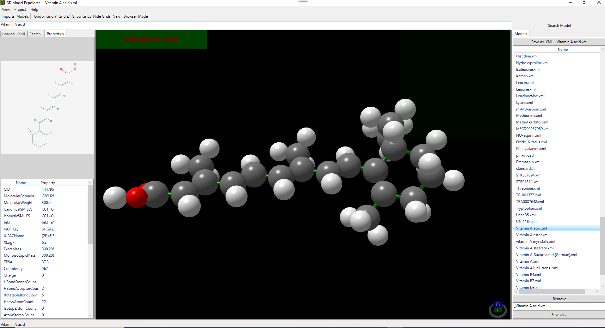

# 3D Model Explorer

Program designed to fetching 3D substances formulas, loading, viewing and editing 3D views.

3D formulas are retrieved from external service by REST protocol.

3D formulas are written in XML format, that has been serialized to .NET classes (C#).

Retrived 3d formula are converted to .NET classes.

Particles are then visualized in Helix3D library.

# Requirements

.NET Framework 4.8 installed

# Installation and build

Build Helix3D library from repository.

Copy build files into Libraries directory.

Open ModelExplorer.sln in Visual Studio, Restore NuGet packages, build an run.

# User Interface

1. Menu and Toolbar commands
2. Search panel with control to place search text and 'Search Model' button
3. Three panels:
   * Imporers with pages
     * Loaded XML
     * Search - results of search 
     * Properties - with particles chemical formula
   * 3D Model Viewer
   * Models page
   
# Data Sources

Particle chemical formulas and 3D properties are taken by means of REST protocol from service "https://pubchem.ncbi.nlm.nih.gov"

# Technology

Written in WPF in .NET Framework 4.8

3D library from https://github.com/helix-toolkit/helix-toolkit repository

Rest client from https://github.com/restsharp/RestSharp repository

Chromium Sharp for WPF from https://github.com/cefsharp/CefSharp

# Workflows
The Model Explorer runs in Viewer Mode and Browser Mode.

## Viewer Mode

There are three main ways to explore 3D particle views.

1. Loaded directly models in XML are saved and displayed in page 'Loaded - XML'
Selection of the file, displays the 3D model view and saves the model into Models tab in the internal format

2. 3D models saved in the internal format can be viewed by selecting names of models in the 'Models' tab

3. Entering desired phrase in the search box and pressing Search Model button, displays list of retrieved compounds and particles. 
After selecting particles names in the 'Search' tab -> models are retrieved and created in the 'Models' tab

*Model Explorer in Viewer Mode, left panel with Importers - visible Property tab, right panel Models - with imported models*

## Browser Mode

Model Explorer has functionality to search for particle information from Wikipedia pages when switched to Browser Mode. After enetering search text in 'Search box' and pressing 'Search Browser' - all retrieved linkt to relevent Wikipedia pages are displayed in Browser tab. After selecting the position, it is displayed in the Browser control.

